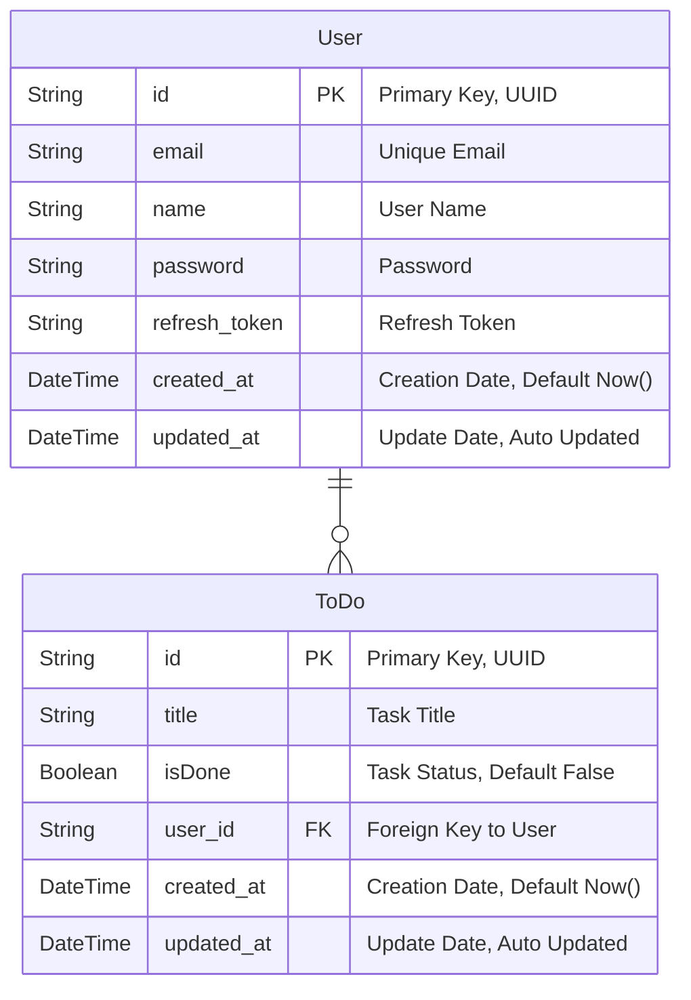

# ToDo List

O objetivo do projeto é gerenciar uma lista de tarefas, permitindo adicionar, marcar como concluídas e excluir tarefas.

## Tecnologias utilizadas

- **TypeScript** - Uma linguagem de programação orientada a objetos.

- **React** - Um framework para criar interfaces de usuário interativas e dinâmicas.

- **Vite** - Um bundler e construtor de aplicativos web.

- **Tailwind CSS** - Um framework de estilos CSS.

- **Node.js** - Um ambiente de execução JavaScript ao lado do servidor.

- **NestJs** - Um framework para desenvolvimento de aplicativos Node.js.

- **Jest** - Um framework de teste unitário para JavaScript e TypeScript.

- **Stryker** - Um framework de mutação para JavaScript e TypeScript.

- **Prisma** - Um ORM para Node.js, usado para interagir com o banco de dados.

- **SQLite** - Um banco de dados relacional leve, usado para desenvolvimento.

- **Swagger** - Uma ferramenta para documentação de APIs.

- **Docker** - Uma plataforma de containerização.

- **Terraform** - Uma ferramenta de infraestrutura como código.

- **ECS** - Um gerenciador de containers de computação em tempo real gerenciado por AWS.

## Desing Patterns

- **Repository Pattern** - Um padrão de projeto que separa a implementação do acesso ao banco de dados de sua aplicação.

- **TDD** - Um paradigma de desenvolvimento de software que utiliza testes para garantir a qualidade de um código.

## Arquitetura


## Diagrama do Banco de Dados



## Instalação

### Docker

1. Clonar o repositório:

   ```bash
   git clone https://github.com/LucaGuidoRegolini/todoList_project.git
   ```

2. Criar containers Docker:

    ```bash
   cd todoList_project
   docker compose up -d
   ```

    > **Obs**: O projeto estará disponível em <http://localhost:3000>

### Terraform

> É necessário estar conectado ao AWS CLI


1. Clonar o repositório:

   ```bash
   git clone https://github.com/LucaGuidoRegolini/todoList_project.git
   ```

2. Criar bucket no S3:

    Nessa etapa, você precisará criar um bucket no S3 com o nome `terraform-todo-list-project`. O bucket deverá estar na região `us-east-1` e ter o acesso `private`.

3. Iniciar terraform:

    ```bash
   cd todoList_project/terraform/environment/develop
   terraform init
   ```

4. Executar terraform:

    ```bash
   terraform apply
   ```
> Será necessário informar os valores de `TF_VAR_JWT_SECRET` e `TF_VAR_REFRESH_SECRET`, que poderão ser qualquer string.

No final do projeto, o terraforms irá devolver os outputs:
- `website_http` - Url do S3, poderá ser usado para acessar o front usando http
- `load_balancer_url` - Url do load balancer, poderá ser usado para acessar o back usando http

## Documentação

O projeto conta com o Swagger para criar a documentação da API. Para acessar a documentação, basta acessar a url [http://localhost:3000/docs](http://localhost:3000/docs)

## Testes

Para rodar os testes unitários, basta executar o comando `npm run test`

Para rodar os testes de mutação, basta executar o comando `npm run test:mutator`
